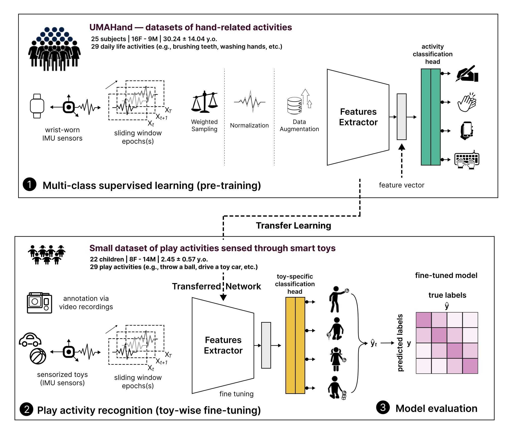

<h1 align="center">
<b>Wear2Toy: Leveraging Wearable Devices for Hand-Held Objects Activity Recognition</b>
</h2>
 <p align="center">
  
  
  

 <p align="center">
  <a href="#-abstract"> 📋 Abstract</a> •
  <a href="#-dependencies"> 📄 Dependencies</a> •
  <a href="#-code-directory-structure"> 📁 Code Directory Structure</a>
  <p align="center">
  <a href="#-license"> 🔑 License</a> •
  <a href="#-citation"> 📜 Citation</a> •
  <a href="#-acknowledgements"> 🙏🏼 Acknowledgements</a>

This repository contains the code for the paper "Wear2Toy: Leveraging Wearable Devices for Hand-Held Objects Activity Recognition" accepted at the [22nd Context and Activity Modeling and Recognition (CoMoRe-AI 26)](https://sites.google.com/view/comoreai26), satellite event of the [24th Annual IEEE International Conference on Pervasive Computing and Communications (PerCom2026)](https://percom.org/2024/).
Please find the paper within the [IEEE PerCom'26 Workshops proceedings (IEEE Computer Society Press)](https://ieeexplore.ieee.org/xpl/conhome/1000551/all-proceedings).


<p align="center">
  
</p>


## 📋 Abstract
> Play is a fundamental component of children’s cognitive and social development. In early childhood, before the emergence of speech and structured social communication, play serves as a key marker of neurodevelopment.
Characterizing play behaviors and fine motor skills through inertial sensing offers valuable opportunities for the early diagnosis of neurodevelopmental disorders (NDDs). However, current Human Activity Recognition (HAR) approaches based on inertial data are poorly suited to this context, largely due to the difficulty in recognizing fine-grained play behaviors and the scarcity of annotated datasets.
In this paper, we present a novel approach for recognizing fine-grained play activities in children, addressing the challenge of data scarcity. Our approach leverages inertial data from wearable devices worn by adults during activities of daily living, extracting and transferring knowledge to improve the recognition of children’s interactions with hand-held devices (smart toys) equipped with Inertial Measurement Units (IMUs).
We evaluated the method in a clinical setting with 22 children diagnosed with Autism Spectrum Disorder (ASD), whose play activities were recorded during ADOS-2 gold-standard diagnostic sessions. Experimental results demonstrate that our approach outperforms conventional HAR baselines, showing that knowledge transfer from wearable to hand-held devices is effective in capturing fine-grained play behaviors.
This advancement supports more accurate characterization of play in clinical contexts and represents a crucial step toward early diagnosis of NDDs in children.

## 📄 Dependencies
> **IMPORTANT**  
> The project is based on Python 3.12

You can install the required dependencies by running:
```bash
pip install -r requirements.txt
```

## 📁 Code Directory Structure
```python
├── assets
├── data
│   ├── external       <- Data from third party sources.
│   ├── interim        <- Intermediate data that has been transformed.
│   ├── processed      <- The final datasets for modeling.
│   └── raw            <- The original data dump.
│
├── models             <- Checkpoints of the best models obtained after the PT stage
│
├── reports            <- Generated analysis as subfolder per experiment.
│   └── figures        <- Generated graphics and figures per experiment.
│
├── HumanActivityRecognition    <- Source code.
│   ├── __init__.py
│   ├── app_config.py           <- Store useful variables and configuration
│   ├── logs                    <- Logs gnerated by running scripts   
│   ├── modeling                <- Code to run model inference with trained models   
│   ├── models                  <- Code to run model inference with trained models   
│   └── utils                   <- Code to run model inference with trained models
│
├── supplementary      <- Supplementary material related to the project (PDF).
│
├── Dockerfile         <- Dockerfile containing just the environment to run experiments (no code)
├── LICENSE
├── README.md
└── requirements.txt
```

## 🔑 License
This project is licensed under the MIT License — see the [LICENSE](LICENSE) file for details.

## 📜 Citation
Please use:
```bibtex
@inproceedings{laporta2026wear2toy,
  title={Wear2Toy: Leveraging Wearable Devices for Hand-Held Objects Activity Recognition},
  author={La Porta, Nicolò and Di Maio, Carolina and Faraci, Francesca D. and Bronwyn, Glaser and Ramelli, Gian Paolo and Papandrea, Michela},
  booktitle={IEEE PerCom'26 Workshops proceedings},
  pages={},
  year={2026}
}
```

## 🙏🏼 Acknowledgements
```
This research is supported by the AI4Autism project (Digital Phenotyping of Autism Spectrum Disorders in children,
grant agreement no. CR- SII5 202235 / 1) of the Sinergia interdisciplinary program of the SNSF.
```
--------